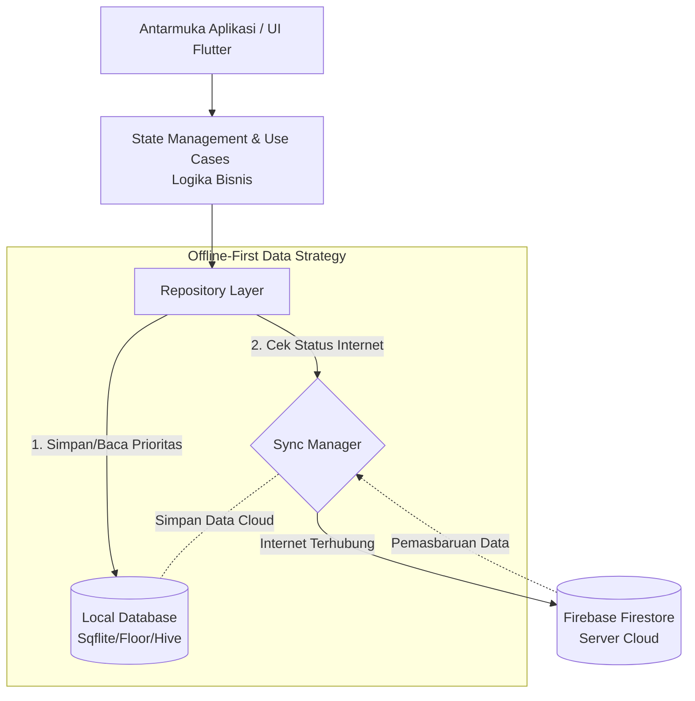
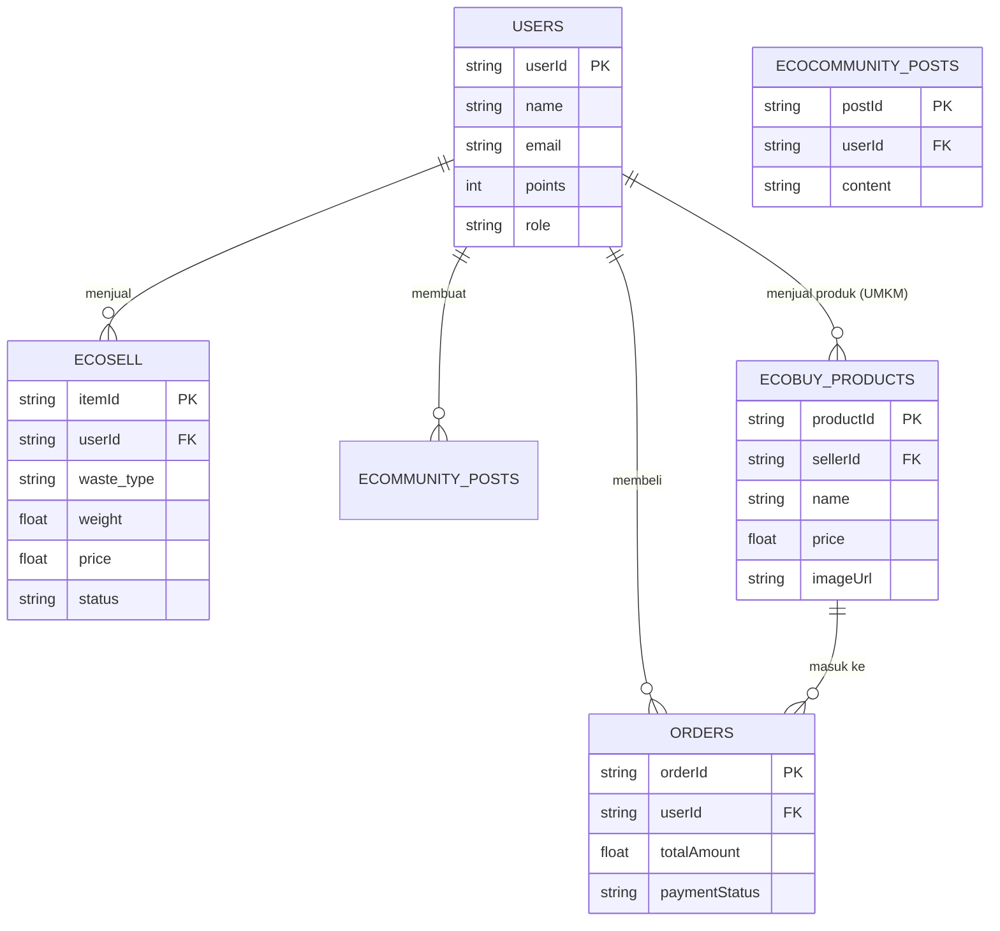

# PRD — Product Requirements Document

## 1. Overview
**EcoCycle** adalah aplikasi cerdas berbasis ekonomi sirkular (circular economy) yang menghubungkan masyarakat (penghasil sampah) dengan pengelola (Bank Sampah), kurir, dan pelaku UMKM ramah lingkungan. 

Masalah utama yang ingin diselesaikan adalah kurangnya efisiensi dalam pengelolaan sampah, minimnya insentif bagi masyarakat untuk memilah sampah, serta kendala konektivitas internet di beberapa daerah operasional. EcoCycle hadir dengan pendekatan **Offline-First**, memastikan pengguna tetap bisa mencatat dan melakukan transaksi sampah meskipun tidak ada sinyal internet. Aplikasi ini tidak hanya membantu mengelola sampah, tetapi juga mengubahnya menjadi sumber nilai ekonomi melalui aktivitas jual-beli sampah, produk daur ulang, edukasi, dan sistem poin loyalitas.

## 2. Requirements
*   **Platform:** Aplikasi Mobile hybrid untuk **Android & iOS**.
*   **Strategi Sinkronisasi (Offline-First):** Aplikasi harus memprioritaskan penyimpanan lokal. Semua tindakan pengguna disimpan di dalam HP (Lokal Prioritas) dan akan disinkronkan ke server secara otomatis ketika perangkat terhubung dengan internet (konsep *last-write-wins*).
*   **Hak Akses & Peran (Roles):** 
    *   Pengguna (Masyarakat umum)
    *   Bank Sampah (Pengelola/Pengepul)
    *   Kurir (Penjemput sampah)
    *   Admin Pusat (Pengendali sistem)
*   **Sistem Pembayaran:** Mendukung QRIS, Transfer Bank, E-Wallet (DANA, BRI, dll), dan Cash on Delivery (COD).
*   **Sistem Notifikasi:** Meliputi pembaruan Status Transaksi, Update Komunitas, dan Pengingat Jadwal (Jemput/Setor).

## 3. Core Features
*   **ECOSell (Jual Sampah):** Fitur bagi pengguna untuk menjual sampah anorganik yang telah dipilah. Pengguna memasukkan berat/jenis sampah dan dapat mencairkan dana ke e-wallet atau bank lokal.
*   **ECOBuy (Marketplace Daur Ulang):** Pasar digital terintegrasi untuk membeli produk-produk kreatif hasil daur ulang UMKM. Lengkap dengan sistem *Add to Cart* dan *Checkout*.
*   **ECOmmunity (Komunitas Sosial):** Ruang diskusi digital berbentuk *feed* di mana pengguna bisa berbagi kegiatan ramah lingkungan, tips, atau aktivitas di sekolah/kampung.
*   **ECOPoint (Sistem Reward):** Sistem poin loyalitas. Pengguna mendapat poin dari menyetor sampah atau menyelesaikan modul edukasi. Poin dapat ditukar dengan voucher atau hadiah.
*   **ECOducation (Edukasi Lingkungan):** Modul interaktif dan kuis seputar cara memilah sampah dan gaya hidup hijau pelestarian lingkungan.
*   **ECOPlanner (Penjadwalan):** Kalender cerdas untuk menjadwalkan penjemputan sampah oleh Kurir atau pengingat waktu menyetor sampah ke Bank Sampah terdekat.

## 4. User Flow
Berikut adalah perjalanan sederhana pengguna dalam aplikasi EcoCycle:
1. **Registrasi & Edukasi:** Pengguna mendaftar, membaca panduan memilah sampah (ECOducation).
2. **Jadwal & Jual Sampah (Offline/Online):** Pengguna mengumpulkan sampah, membuka aplikasi, mencatat berat sampah, dan menjadwalkan penjemputan (ECOPlanner + ECOSell). Jika tidak ada internet, data disimpan sementara di HP.
3. **Sinkronisasi Otomatis:** Saat HP mendapat sinyal internet, data penjualan tadi otomatis terkirim ke sistem pusat (Firebase).
4. **Penjemputan & Pembayaran:** Kurir menerima notifikasi, menjemput sampah. Transaksi selesai. Uang masuk ke saldo E-Wallet pengguna, dan pengguna juga mendapatkan *ECOPoints*.
5. **Belanja Daur Ulang:** Pengguna menggunakan saldo atau menukarkan poin untuk membeli produk daur ulang di fitur *ECOBuy*, mendukung industri sirkular.

## 5. Architecture
Aplikasi ini menggunakan pendekatan **Clean Architecture** untuk memisahkan tampilan Antarmuka (UI), logika bisnis, dan pengelolaan data. Dalam ekosistem Flutter, pola ini sering diimplementasikan dengan kombinasi **BLoC** atau **Riverpod** untuk manajemen state.

Pusat dari arsitektur ini adalah sistem **Lokal Prioritas (Offline-First)**, di mana setiap interaksi pengguna disimpan ke dalam database internal HP terlebih dahulu, lalu di-sync ke Cloud (Firebase) ketika jaringan stabil.

## 6. Database Schema
Berikut adalah tabel/koleksi utama yang dibutuhkan untuk menjalankan sistem aplikasi beserta tipe data dan kegunaannya.

*   **Users** (Menyimpan data akun dan saldo)
    *   `userId` (String) - ID Unik pengguna.
    *   `name` (String) - Nama lengkap.
    *   `email` (String) - Alamat email.
    *   `points` (Integer) - Total ECOPoints.
    *   `role` (String) - Peran (User, Bank Sampah, Kurir, Admin).
    *   `createdOn` (Timestamp) - Tanggal akun dibuat.
*   **ECOSell** (Data penjualan sampah)
    *   `itemId` (String) - ID Transaksi Jual.
    *   `userId` (String) - Pemilik sampah.
    *   `waste_type` (String) - Jenis sampah (Plastik, Kertas, dll).
    *   `weight` (Float) - Berat sampah (Kg).
    *   `price` (Float) - Total harga estimasi.
    *   `status` (String) - Status (pending_sync, scheduled, sold).
    *   `payment_method` (String) - Dana, BRI, dll.
*   **ECOBuy_Products** (Katalog produk daur ulang)
    *   `productId` (String) - ID Produk.
    *   `sellerId` (String) - ID Penjual/UMKM.
    *   `name` (String) - Nama produk.
    *   `price` (Float) - Harga jual.
    *   `imageUrl` (String) - Tautan foto produk (Firebase Storage).
*   **Orders** (Transaksi belanja di ECOBuy)
    *   `orderId` (String) - ID Pesanan.
    *   `userId` (String) - ID Pembeli.
    *   `totalAmount` (Float) - Total pembayaran.
    *   `paymentStatus` (String) - Successful / Failed.
*   **ECOmmunity_Posts** (Konten forum/komunitas)
    *   `postId` (String) - ID Postingan.
    *   `userId` (String) - Pembuat konten.
    *   `content` (String) - Isi teks postingan.
    *   `imageUrl` (String) - Gambar terlampir (opsional).

## 7. Tech Stack
*   **Frontend (Aplikasi Mobile):** **Flutter (Dart)**. Framework UI SDK dari Google ini dipilih untuk membangun aplikasi native-compiled untuk mobile, web, dan desktop dari satu basis kode (*codebase*). Flutter menawarkan performa tinggi, pengembangan yang cepat (*hot reload*), dan dukungan komunitas yang besar untuk fitur *offline-first*.
*   **Backend & Cloud Database:** **Firebase**. Mencakup *Firestore* untuk database server, *Firebase Authentication* (Email/Google) untuk sistem login, dan *Firebase Storage* untuk menyimpan gambar/foto produk.
*   **Database Lokal (Offline):** **Sqflite / Floor / Hive**. Penggunaan database lokal seperti Sqflite (SQLite flutter) atau Floor (abstraksi SQLite) untuk menyimpan data secara lokal di memori HP. Didukung oleh **Dart Streams** agar UI otomatis beradaptasi saat data berubah akibat sinkronisasi.
*   **Dependency Injection:** **GetIt / Injectable**. Digunakan untuk manajemen ketergantungan (*dependency injection*) agar kode lebih modular, mudah dites, dan sesuai prinsip *Clean Architecture*.
*   **Deployment & Opsional Backend Ekstra:** **VPS (Virtual Private Server)** yang difungsikan untuk *deployment* panel admin pusat (jika diperlukan panel berbasis web di kemudian hari) dan penanganan sistem *webhook* pembayaran pihak ketiga seperti QRIS atau bank lokal.